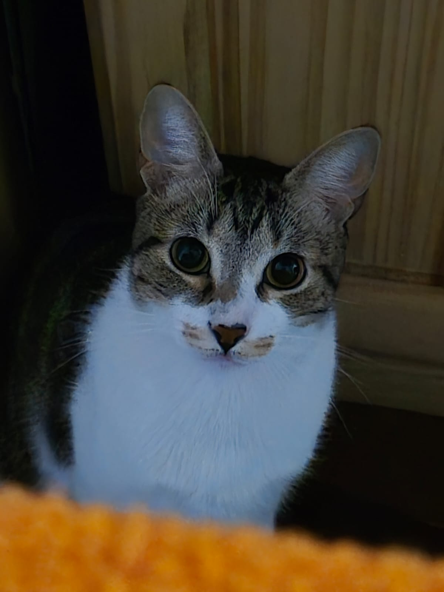

### Lucio Vasquez  

---

### "Software developer" y Analista QA

Aprendí lo *poco* que sé en relación a la programación por mi cuenta antes de anotarme en la carrera.
Todavía sorprendido por la decisión porque nunca fue de mi interés, pero eventualmente concluí que me podría llegar a permitir estar es muchos equipos de desarrollo tecnológico, lo que sí me resultaba llamativo.
En la empresa donde trabajo lo que hacemos es <ins>staff augmentation</ins> y desarrollo de MVPs. Usamos todo tipo de lenguajes y tecnologías que nos sirvan en el momento y creamos útiles, por supuesto siempre intentando no desviarnos demasiado de las tecnologías que están de moda o que creamos que van a tener largo soporte.
Trato de entrenar lo más que puedo pero sin exigirme demasiado, de estudiar lo que me interese en el momento, y de no dejar los hobbies de lado.

### Mi loco gato

  

### Mis canciones favoritas de este año

- La paciencia recompensa [I don't trust myself - John Mayer](https://youtu.be/QaVu9lYvko0?si=eJqCmHOTBawtNswi)
- Altamente recomendada [Sth about us - Daft Punk cover](https://youtu.be/jjxx1RY2krQ?si=BFOnZXhffc7sVz4I)